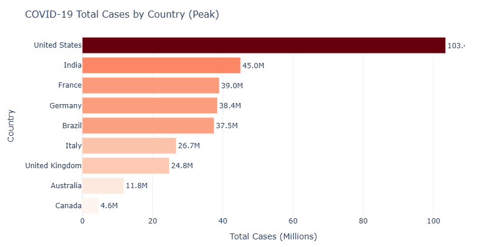
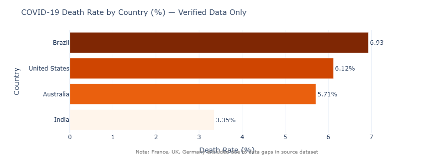
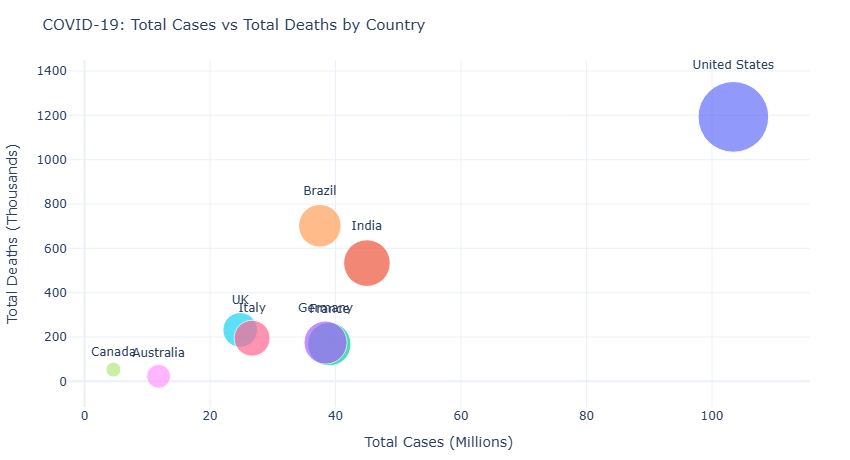

# covid19-etl-pipeline

ETL pipeline processing real COVID-19 data from Our World in Data — 429,435 rows across 255 countries, filtered down to 9 for analysis. Built this after the ecommerce project to practice working with time-series public health data instead of synthetic orders.

---

## what it does

```
extract (Our World in Data CSV — 429,435 rows, 255 countries)
    ↓
transform (filter to 9 countries, add death_rate — 14,331 rows)
    ↓
PySpark analysis (SQL aggregations on the Spark DataFrame)
    ↓
load → DuckDB (covid_warehouse.db)
    ↓
SQL analysis + Plotly dashboard
    ↓
data quality checks
```

---

## stack

- Python, pandas — extract and transform
- PySpark — ran country comparisons and trend queries
- DuckDB — local warehouse
- Apache Airflow — daily DAG, 2 retries
- Plotly — dashboard charts

---

## dataset

Source: Our World in Data COVID-19 dataset (publicly available CSV).
Raw: 429,435 rows, 255 countries. After filtering to 9 countries: 14,331 rows.

Countries: United States, India, Brazil, United Kingdom, France, Germany, Italy, Canada, Australia.

Columns used: location, date, total_cases, total_deaths, new_cases, new_deaths, population, total_vaccinations, continent.

---

## findings

- USA: 103M total cases (#1 by volume), 6.12% death rate
- India: 45M cases, 3.35% death rate
- France: 39M cases (death rate calculation affected by data gaps in source)
- Germany: 38.4M cases, 5.20% death rate
- Brazil: 37.5M cases, 6.93% death rate
- Brazil and USA have the highest verified death rates among the 9 countries
- All 4 quality checks passed (missing, duplicates, valid dates, non-empty)

---

## airflow dag

```
extract_covid_data >> transform_clean >> spark_analysis >> load_duckdb >> data_quality_checks
```

Daily schedule, catchup=False, 2 retries per task.

---

## dashboard

**Total cases by country**


**Death rate comparison (verified countries)**


**Cases vs Deaths bubble chart**


---

## how to run

```bash
pip install -r requirements.txt

# notebook (Google Colab)
# open COVID_19_Pipeline.ipynb and run all cells

# airflow
cp dags/covid_dag.py $AIRFLOW_HOME/dags/
airflow dags trigger covid19_pipeline
```
